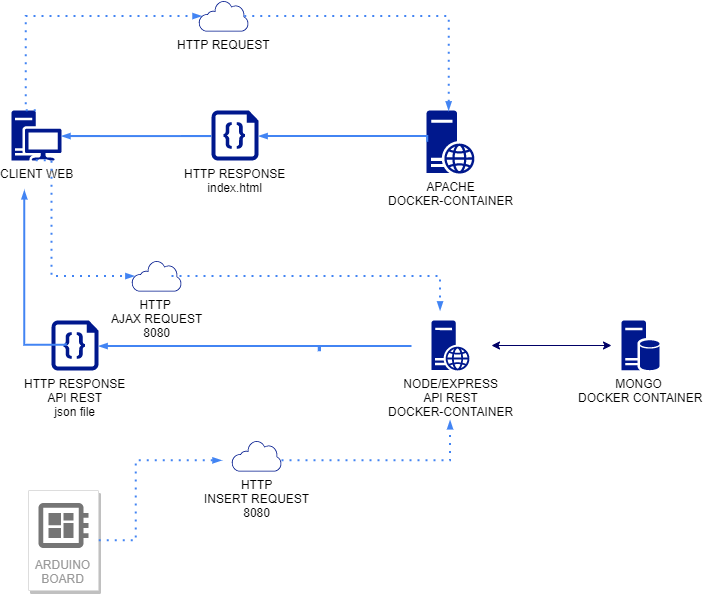

# IoT
La funcionalidad de este proyecto es el **registro de datos** (inicialmente temperatura y humedad) a través de una **placa arduino** con diferentes sensores

Los datos registrados serán transmitidos por la red hacia un servidor **express de nodejs** que se encargará de persistirlos en una base de datos mongodb, por otra parte el mismo servidor **express** ofrece los datos a través de una api rest que serán consumidos por un cliente web  mediante consultas ajax que recibirán datos en formato json (en un futuro los disitintos tipos de clientes se irán aumentando android, ionic, .net, ...)


## Arquitectura del proyecto
En la siguiente imagen se puede ver la arquitectura del proyecto




La documentación del proyecto esta dividida en dos partes claramente diferenciadas:
1. Software del servidor y cliente web
2. Placa arduino

## Sofware del servidor y cliente web

### Requisitos del servidor
Es necesaria la instalación de [docker](https://docs.docker.com/install/) y [docker-compose](https://docs.docker.com/compose/install/)

### Fichero docker-compose.yml
Contiene la descripción de tres servicios

1. La base de datos mongo

```console
  db:
    image: mongo:4.0
    ...
    environment:
      MONGO_INITDB_ROOT_USERNAME: root
      MONGO_INITDB_ROOT_PASSWORD: root
      MONGO_INITDB_DATABASE: datadb
    volumes:
      - ./backend/mongo-dump:/docker-entrypoint-initdb.d
      - mongo-volume:/data/db
```

Unicamente comentar que el volumen ./backend/mongo-dump contiene un fichero con la configuración inicial de la base de datos con la que configuraremos la conexión desde express de nodejs
Además contiene un volumen donde se persistirán los ficheros de mongo

```js
db.createUser(
    {
        user: "dev",
        pwd: "dev",
        roles: [
            {
                role: "readWrite",
                db: "datadb"
            }
        ]
    }
);
```

2. Servidor de aplicaciones
Se trata de un servidor express de nodejs encargado de proporcionar una api rest tanto para la consulta de los registros de temperatura y humedad, como la inserción de nuevos registros

Se construye una imagen propia (./backend/Dockerfile) a partir de una imagen oficial de mongo, en donde se copian los ficheros de la aplicación, se instalan las dependencias del proyecto y se arranca el servidor

```console
FROM node:12.13.1-stretch
...
COPY src/* ./
RUN npm install
CMD [ "npm", "start" ]
```

3. Cliente web.
Unicamente se trata de una página web con diferentes tipos de gráficos, para los gráficos se utiliza la librería plotly que permite generar gráficos a partir de json
Las objetos json son obtenidos mediante sucesivas llamadas ajax al servidor express

```js
    var url = '...';
    $.ajax({
        url: url,
        contentType: "application/json",
        crossDomain: true,
        dataType: 'json',
        success: function(result){

            const temperatures  = result.measures.map( obj => obj.temperature );
            const humidities    = result.measures.map( obj => obj.humidity );
            const dates         = result.measures.map( obj => obj.created );
            var temperaturesTrace = {
                type: 'scatter',
                mode: 'lines',
                name: 'Temperatures',
                x: dates,
                y: temperatures,
                line: {color: '#17BECF'}
            }
            var humiditiesTrace = {
                type: 'scatter',
                mode: 'lines',
                name: 'Humidities',
                x: dates,
                y: humidities,
                line: {color: '#7F7F7F'}
            }
            var layout = {
                title: '10 MINUTOS',
                xaxis: {
                    range: [first, last],
                    type: 'date'
                },
                yaxis: {
                  //   autorange: true,
                    range: [0, 100],
                    type: 'linear'
                }
            }
            var data = [temperaturesTrace, humiditiesTrace];
            Plotly.newPlot('lastTenMinutesValues', data, layout);
        },
        ...
    });
```

La página es alojada en un contenedor docker al que unicamente se le copia el index.html
```console
    FROM httpd

    WORKDIR /usr/local/apache2/htdocs/

    COPY src/* .
```


### Puesta en marcha del servidor
Una vez clonado el proyecto, situarse en el directorio raiz del mismo

Pasos:
1. Creación del volumen para la persistencia de los datos de mongo
```console
docker volume create mongo-volume
```

2. Arrancar los contenedores
```console
docker-compose up -d
```


